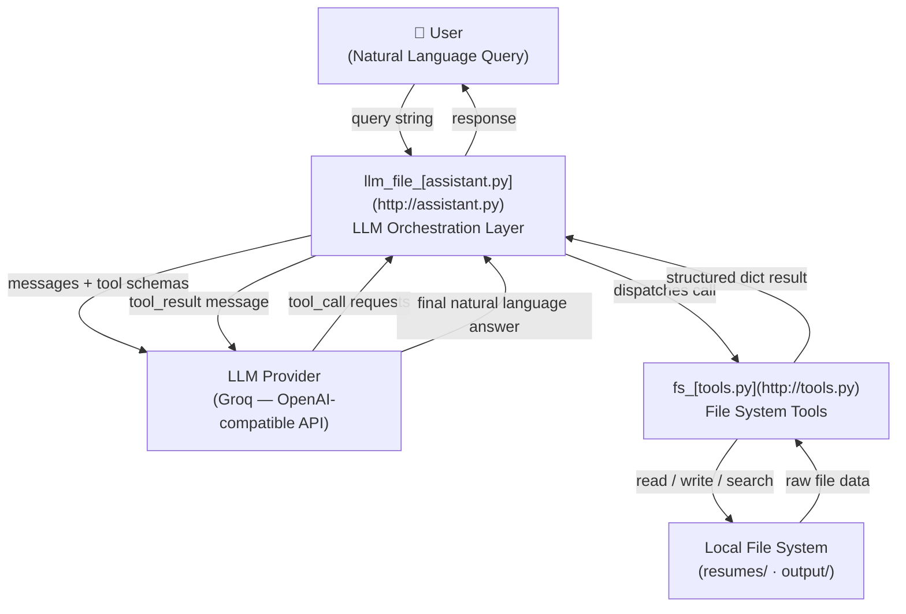
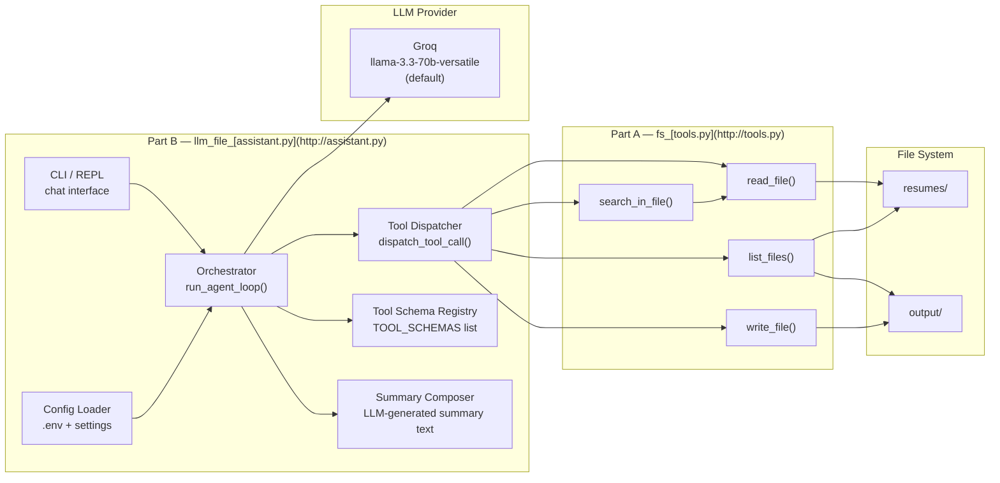
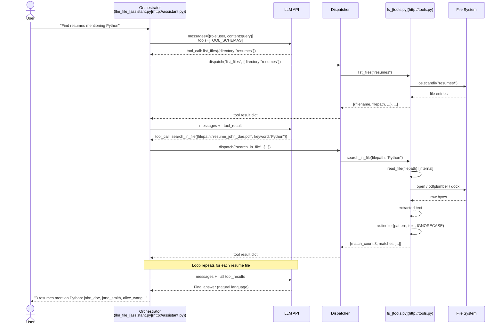
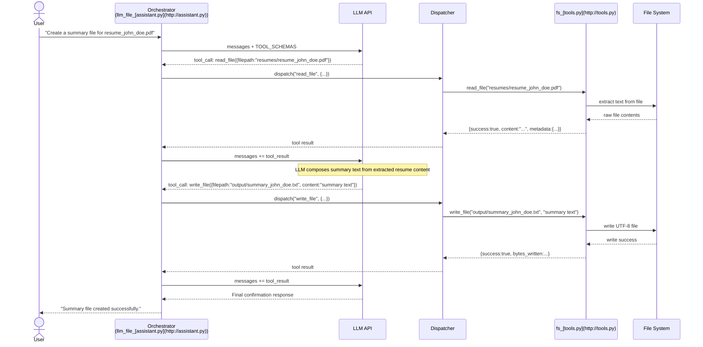
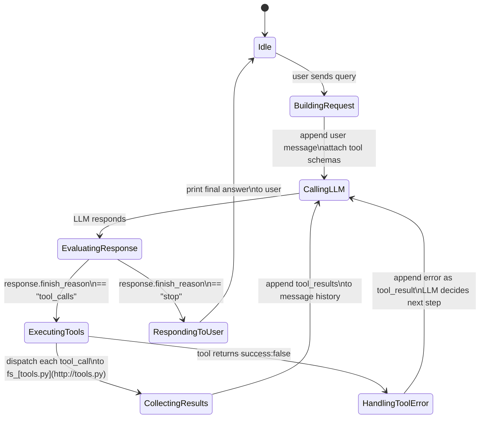
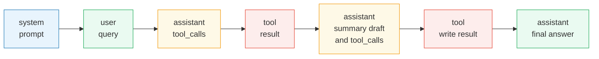
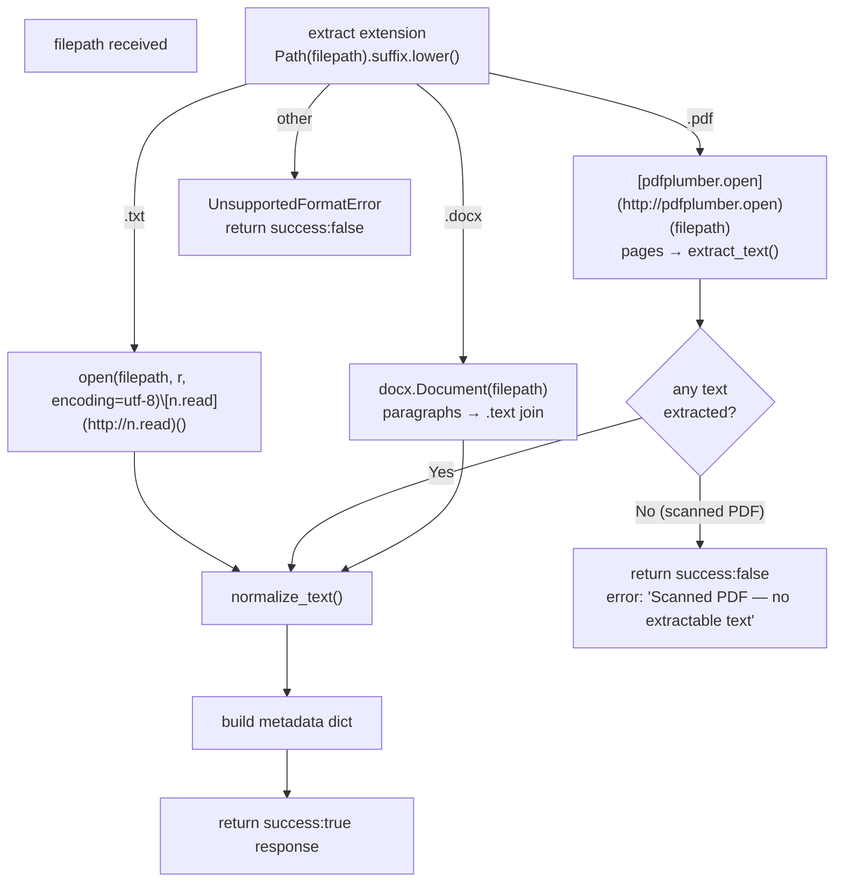

# Architecture: LLM-Powered File System Assistant

---

## 1. High-Level System Overview



---

## 2. Module Decomposition



---

## 3. Agentic Tool-Calling Loop (Sequence Diagram)



### Summary File Creation Flow



---

## 4. `fs_tools.py` — Internal Tool Architecture

```mermaid

graph TD

    subgraph "read_file(filepath)"

        RF_IN["filepath: str"]

        RF_EXT["detect extension<br/>.pdf / .txt / .docx"]

        RF_TXT["open() UTF-8<br/>read text"]

        RF_PDF["pdfplumber<br/>extract_text() per page"]

        RF_DOC["python-docx<br/>paragraph.text join"]

        RF_NORM["normalize_text()<br/>strip whitespace"]

        RF_META["build metadata<br/>size · word_count · modified_at"]

        RF_OUT["return dict<br/>{success, content, metadata}"]

        RF_ERR["catch Exception<br/>return {success:false, error}"]

        RF_IN --> RF_EXT

        RF_EXT -->|".txt"| RF_TXT

        RF_EXT -->|".pdf"| RF_PDF

        RF_EXT -->|".docx"| RF_DOC

        RF_TXT --> RF_NORM

        RF_PDF --> RF_NORM

        RF_DOC --> RF_NORM

        RF_NORM --> RF_META

        RF_META --> RF_OUT

        RF_EXT -->|"unsupported"| RF_ERR

        RF_PDF -->|"exception"| RF_ERR

    end

    subgraph "list_files(directory, extension)"

        LF_IN["directory · extension"]

        LF_CHK["os.path.isdir() check"]

        LF_SCAN["os.scandir()"]

        LF_FILT["filter by extension<br/>(case-insensitive)"]

        LF_SORT["sort by filename"]

        LF_META2["stat() → size · modified_at"]

        LF_OUT["return list[dict]"]

        LF_IN --> LF_CHK

        LF_CHK -->|"exists"| LF_SCAN

        LF_CHK -->|"missing"| LF_OUT

        LF_SCAN --> LF_FILT

        LF_FILT --> LF_SORT

        LF_SORT --> LF_META2

        LF_META2 --> LF_OUT

    end

    subgraph "write_file(filepath, content)"

        WF_IN["filepath · content"]

        WF_SEC["security check<br/>path within allowed dirs"]

        WF_DIRS["os.makedirs(exist_ok=True)"]

        WF_WRITE["open(w, utf-8).write()"]

        WF_OUT["return {success, bytes_written, created_dirs}"]

        WF_ERR2["catch PermissionError / OSError<br/>return {success:false, error}"]

        WF_IN --> WF_SEC

        WF_SEC -->|"safe"| WF_DIRS

        WF_SEC -->|"unsafe"| WF_ERR2

        WF_DIRS --> WF_WRITE

        WF_WRITE --> WF_OUT

        WF_WRITE -->|"exception"| WF_ERR2

    end

    subgraph "search_in_file(filepath, keyword)"

        SF_IN["filepath · keyword"]

        SF_READ["calls read_file(filepath)"]

        SF_CHK2["check read success"]

        SF_RE["re.finditer(keyword, text, IGNORECASE)"]

        SF_CTX["extract context window<br/>(±100 chars per match)"]

        SF_OUT["return {match_count, matches[]}"]

        SF_ERR3["propagate read error"]

        SF_IN --> SF_READ

        SF_READ -->|"success:true"| SF_CHK2

        SF_READ -->|"success:false"| SF_ERR3

        SF_CHK2 --> SF_RE

        SF_RE --> SF_CTX

        SF_CTX --> SF_OUT

    end

```



---

## 5. `llm_file_assistant.py` — Orchestrator State Machine



---

## 6. Data Flow: Message History Structure

Each turn appends to a running `messages` list passed to the LLM:

```

messages = [

  {role: "system",    content: SYSTEM_PROMPT},

    {role: "user",      content: "Create a summary file for resume_john_doe.pdf"},

    {role: "assistant", tool_calls: [{id, name:"read_file", arguments:{...}}]},

    {role: "tool",      tool_call_id: id, content: "{content:'...', metadata:{...}}"},

    {role: "assistant", tool_calls: [{id, name:"write_file", arguments:{...}}]},

    {role: "tool",      tool_call_id: id, content: "{success:true, bytes_written:...}"},

  ...

  {role: "assistant", content: "Final natural language answer"}

]

```



---

## 7. Security Architecture

```mermaid

graph TD

    subgraph "Threat: Path Traversal"

        PT_IN["filepath input<br/>e.g. '../../etc/passwd'"]

        PT_RESOLVE["os.path.realpath(filepath)"]

        PT_CHECK["startswith(ALLOWED_ROOT)?"]

        PT_BLOCK["return {success:false,<br/>error:'Path not allowed'}"]

        PT_ALLOW["proceed with I/O"]

        PT_IN --> PT_RESOLVE

        PT_RESOLVE --> PT_CHECK

        PT_CHECK -->|"No"| PT_BLOCK

        PT_CHECK -->|"Yes"| PT_ALLOW

    end

    subgraph "Threat: Credential Exposure"

        ENV[".env file"]

        DOTENV["python-dotenv\nload_dotenv()"]

        OS_ENV["os.environ.get('GROQ_API_KEY')"]

        CLIENT["LLM client init"]

        ENV --> DOTENV

        DOTENV --> OS_ENV

        OS_ENV --> CLIENT

    end

    subgraph "Threat: Unconstrained Write"

        WR_PATH["write target path"]

        WR_ROOT["resolve against OUTPUT_DIR"]

        WR_GATE["within output/ ?"]

        WR_DENY["reject write"]

        WR_OK["write file"]

        WR_PATH --> WR_ROOT

        WR_ROOT --> WR_GATE

        WR_GATE -->|"No"| WR_DENY

        WR_GATE -->|"Yes"| WR_OK

    end

```



---

## 8. File Format Handling Decision Tree



---

## 9. Directory & File Layout

```

airTribe LLM Project/

│

├── docs/

│   ├── [context.md](http://context.md)          ← problem statement & specs

│   └── [architecture.md](http://architecture.md)     ← this file

│

├── resumes/                ← INPUT (read-only at runtime)

│   ├── resume_john_doe.pdf

│   ├── resume_jane_smith.docx

│   └── resume_alice_wang.txt

│

├── output/                 ← OUTPUT (write_file target)

│   └── summary_john_doe.txt

│

├── fs_[tools.py](http://tools.py)             ← Part A: 4 tool functions

├── llm_file_[assistant.py](http://assistant.py)   ← Part B: LLM orchestration + CLI

├── requirements.txt

└── .env                    ← secrets (gitignored)

```

---

## 10. Component Responsibility Summary

| Component | File | Responsibility |

|-----------|------|---------------|

| Tool functions | `fs_tools.py` | All file I/O; return structured dicts; no exceptions to caller |

| Tool schemas | `llm_file_assistant.py` | JSON Schema definitions for LLM function calling |

| Orchestrator | `llm_file_assistant.py` | Message history management; agentic loop; LLM API calls |

| Summary composer | `llm_file_assistant.py` | Converts extracted resume text into a grounded summary before `write_file()` |

| Dispatcher | `llm_file_assistant.py` | Routes `tool_call` names → Python functions |

| Config | `.env` + `python-dotenv` | Provider selection, API keys, directory paths |

| Security guard | `fs_tools.py` | Path traversal checks on every read/write call |